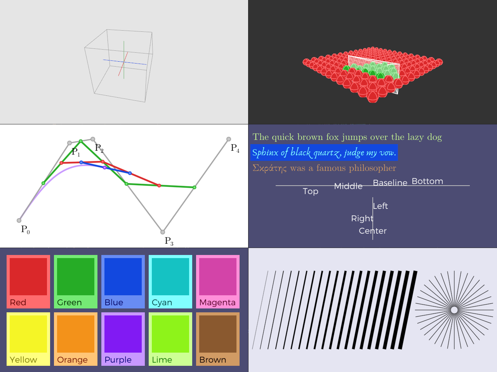

### Work in progress

## dbgdraw

dbgdraw is intended to be a small immediate mode library for putting simple graphics on the screen. Below you can see some examples of what can be achieved in dbgdraw.

### Features

- Written in C99 with minimal dependencies (c stdlib, stb_truetype.h [optional] )
- Validation - user can enable API validation checks 

### Current issues

- No full UTF-8 support, just Latin + Greek character ranges
- Only openGL backends at this point, for OpenGL3.3 and OpenGL4.5

### Usage

To start drawing, one needs to initialize the *dbgdraw* context using `dd_init` function. Then on each frame, some information needs to be provided to *dbgdraw* regarding the application state, like the camera position and viewport size. This can be achieved using the `dd_new_frame` call. Similarly, at the end of the frame, the user requests the content to be rendered using `dd_render`. Once the application is finished, or context is no longer needed, it can be removed using `dd_term`.

Within each frame, the user can begin issuing drawing commands. These need to be surrounded by the `dd_begin_cmd` and `dd_end_cmd`. Within, the user can request any number of primitives to be drawn, using calls like `dd_line`, `dd_sphere`, `dd_aabb`, and so on. There exist a number of state modifying functions of the form `dd_set_x`. For example, `dd_set_color` will modify the color of primitives drawn in subsequent calls.

Code to draw the first example in the above image is :

~~~
/* Initialization time */
dd_ctx_t* dd_ctx = calloc( 1, sizeof(dd_ctx_t) );
dd_ctx_desc_t desc = 
{ 
  .max_vertices = 1024,
  .max_commands = 16,
  .detail_level = 2,
  .enable_frustum_cull = false,
  .enable_depth_test = true 
};
dd_init( dd_ctx, &desc );

/* Frame time */
// Put information about the scene camera and viewport
dd_new_frame_info_t info = { 
    .view_matrix       = view.data,
    .projection_matrix = proj.data,
    .viewport_size     = viewport.data,
    .vertical_fov      = fovy,
    .projection_type   = DBGDRAW_PERSPECTIVE };
dd_new_frame( dd_ctx, &info );

// Prepare some data
vec3 x0 = vec3_negx(); vec3 x1 = vec3_posx();
vec3 y0 = vec3_negy(); vec3 y1 = vec3_posy();
vec3 z0 = vec3_negz(); vec3 z1 = vec3_posz();

// Set primitive size - this will be interpreted as point size if drawing points and line width if drawing lines
dd_set_primitive_size( dd_ctx, 1.0f );

// Set transformation to be used when drawing the subsequent commands
dd_set_transform( dd_ctx, model.data );

// Let's begin drawing lines
dd_begin_cmd( dd_ctx, DBGDRAW_MODE_STROKE );

// Draw axis
dd_set_color( dd_ctx, DBGDRAW_RED );
dd_line( dd_ctx, x0.data, x1.data );
dd_set_color( dd_ctx, DBGDRAW_GREEN );
dd_line( dd_ctx, y0.data, y1.data );
dd_set_color( dd_ctx, DBGDRAW_BLUE );
dd_line( dd_ctx, z0.data, z1.data );

// Draw axis aligned bounding box
dd_set_color( dd_ctx, DBGDRAW_GRAY );
dd_aabb( dd_ctx, vec3( -1.1f, -1.1f, -1.1f ).data, vec3( 1.1f, 1.1f, 1.1f ).data );
dd_end_cmd( dd_ctx );
    
dd_render( dd_ctx );
~~~

Note, that all of the `dd_<xyz>` calls take a pointer to float data, so they should be agnostic to any vector library that you might use! (Except for dbgdraw expecting column-major matrices)

#### Memory
dbgdraw maintains two memory buffers - the command buffer and the vertex buffer. Their initial size is specified in a call to `dd_init(...)`. If the user ever submits more commands/vertices than the amount specified at the initialization time, the memory will be automatically resized. This is done similarly to how it is performed in C++'s '`std::vector`, where the capacity of these buffers will be doubled. 

By default memory allocations are done with `malloc`, `free`, and `realloc`. These defaults can be changed by defining the following macros, before including 'dbgdraw.h': `DBGDRAW_MALLOC(size)`, `DBGDRAW_FREE(ptr)`, `DBGDRAW_REALLOC(ptr, size)`. This way the user can use their own allocators.

Additionally, there is a macro that controls out-of-memory behavior. By redefining `DBGDRAW_HANDLE_OUT_OF_MEMORY(ptr, len, cap, elemsize)` the user can specify different behavior to the growing described above. For example, if you want the application to simply stop accepting commands, if there is no more memory in the initial allocation, you could do the following:
~~~
#define DBGDRAW_HANDLE_OUT_OF_MEMORY(ptr, len, cap, elemsize)     \
  do                                                              \
  {                                                               \
    if (len >= cap)                                               \
    {                                                             \
      return DBGDRAW_ERR_OUT_OF_MEMORY;                           \
    }                                                             \
  } while (0)
~~~
The above code will cause all function that fill-in the buffer to exit early with out of memory error that the client-side might choose to deal with in whichever way they choose.

#### Building

To use dbgdraw you can simply drop the `dbgdraw.h` into your application source tree and add `#define DBGDRAW_IMPLEMENTATION` and `#include "dbgdraw.h"`. Optionally, there is also `dbgdraw.c` that you can add to your build if you wish to avoid the recompilation of the dbgdraw library each time.

To build the examples you can use CMake, by simply
~~
mkdir build
cd build
cmake .. -G "<your favourite generator>"
<build using your preferred method, make, nmake, Visual Studio, etc.>
~~